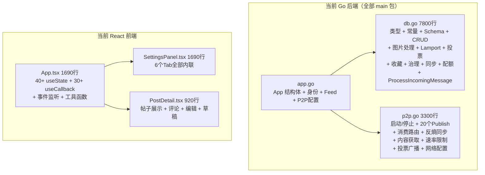
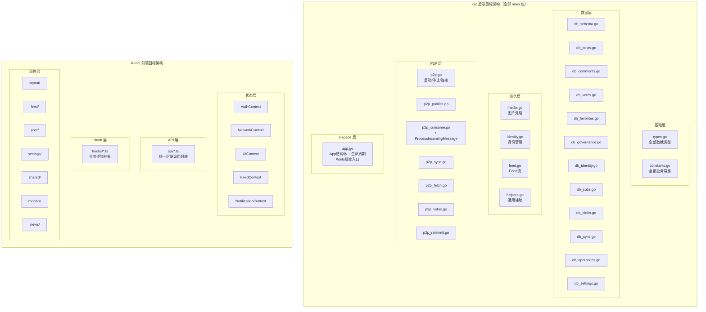

# 技术设计文档：Aegis-App 架构级模块化重构

## 概述

本设计文档描述 Aegis-App（基于 Wails 的 Go + React/TypeScript 去中心化论坛桌面应用）的架构级模块化重构方案。当前代码库存在严重的 God Object 反模式：Go 后端的 `db.go`（7800+ 行）、`p2p.go`（3300+ 行）、`app.go` 中的 App 结构体承载了 14 个 mutex 和全部业务逻辑；React 前端的 `App.tsx`（1690+ 行）包含 40+ 个 useState，`SettingsPanel.tsx`（1690+ 行）和 `PostDetail.tsx`（920+ 行）同样过于臃肿。

本次重构的核心原则是：**纯结构性重构，零功能变更**。所有代码移动和拆分必须保持运行时行为完全一致，Wails 绑定的公开方法签名不变。

### 关键约束

- 所有 Go 文件保持在 `main` 包下（Wails 框架要求）
- `App` 结构体仍然是 Wails 绑定的入口，但通过文件拆分实现逻辑分离
- 保留已有的良好设计：`recommendation.go` 策略模式、`authenticated_messages.go`、`message_outbox.go`、`p2p_config.go`、`p2p_peers.go`
- 前端引入 Context + Hook 模式替代 prop drilling，但不引入额外的状态管理库

## 架构

### 当前架构问题



### 目标架构



### 重构执行顺序

重构分为 4 个阶段，每个阶段完成后必须通过编译和测试：

1. **阶段一：Go 基础层提取**（需求 1）— 提取类型和常量，零风险
2. **阶段二：Go 数据层拆分**（需求 2, 5）— 拆分 db.go，按领域分文件
3. **阶段三：Go P2P 层和业务层拆分**（需求 3, 4）— 拆分 p2p.go，App 结构体瘦身
4. **阶段四：React 前端重构**（需求 6-13）— Context/Hook/组件拆分/API 封装

阶段四内部的执行顺序：
- 4a: 创建 API 封装层（需求 13）— 前端其他重构的基础
- 4b: 提取共享工具函数和组件（需求 11）— 消除重复代码
- 4c: 引入 Context 状态管理（需求 6）
- 4d: 提取自定义 Hook（需求 7）
- 4e: 拆分 SettingsPanel（需求 9）和 PostDetail（需求 10）
- 4f: App.tsx 瘦身与路由重构（需求 8）
- 4g: 目录结构重组（需求 12）— 最后执行，避免中间步骤的路径混乱

## 组件与接口

### Go 后端文件拆分映射

#### 需求 1：types.go + constants.go

**types.go** — 全部数据模型类型定义：

| 来源文件 | 提取类型 |
|---------|---------|
| `db.go` | ForumMessage, PostIndex, PostBodyBlob, MediaBlob, Sub, SubStats, Profile, ProfileDetails, Comment, CommentAttachment, ModerationState, ModerationLog, GovernancePolicy, P2PConfig, PrivacySettings, IdentityState, StorageUsage, FeedStreamItem, FeedStream, PostIndexPage, FavoriteOpRecord, EntityOpRecord, TombstoneGCResult, GovernanceAdmin, SyncPostDigest, SyncCommentDigest, IncomingMessage, KnownPeerExchange, LamportVersion |
| `app.go` | Identity, AntiEntropyStats |
| `notifications.go` | Notification, NotificationPage（保留在 notifications.go，因为与通知逻辑紧密耦合） |

**constants.go** — 全部业务常量：

| 来源文件 | 提取常量 |
|---------|---------|
| `db.go` | totalQuotaBytes, privateQuotaBytes, publicQuotaBytes, postOpTypeCreate/Update/Delete, lamportSchemaV2, authScopeUser, entityTypePost/Comment, voteStateNone/Up/Down, defaultOpNonceBytes |
| `p2p.go` | messageType* 系列常量（需从 consumeP2PMessages 的 switch-case 中提取）、速率限制默认值 |
| `notifications.go` | NotifTypePostComment, NotifTypeCommentReply, NotifTypePostUpvote, NotifTypePostDownvote, NotifTypeCommentUpvote, NotifTypeCommentDownvote, NotifTypeGovernance |

注意：`p2p_peers.go` 中的 `knownPeerBootstrapLimit`、`peerExchangeSendLimit`、`peerExchangeTickSeconds` 保留在原文件，因为它们仅在该文件内使用。

#### 需求 2：db.go 按领域拆分

| 目标文件 | 职责 | 来源函数 |
|---------|------|---------|
| `db_schema.go` | 数据库初始化和 Schema DDL | `initDatabase`, `ensureSchema` |
| `db_posts.go` | 帖子 CRUD | `insertMessage`, `AddLocalPostStructured*`, `GetFeed`, `GetFeedBySub*`, `GetFeedIndexBySubSorted`, `GetPostIndexByID`, `GetMyPosts`, `GetPostsByAuthor`, `GetPrivateFeed`, `UpdateLocalPost`, `deleteLocalPostAsAuthor`, `postExists`, `SearchPosts`, `AddLocalPostWithImageToSub`, `queryPostsBySubSet`, `queryRecommendedPosts` |
| `db_comments.go` | 评论 CRUD | `insertComment`, `AddLocalComment*`, `GetCommentsByPost`, `UpdateLocalComment`, `deleteLocalCommentAsAuthor`, `upsertCommentTombstone` |
| `db_votes.go` | 投票状态机 | `applyPostVoteState`, `applyCommentVoteState`, `applyPostUpvote/Downvote`, `applyCommentUpvote/Downvote`, `currentPostVoteStateTx`, `currentCommentVoteStateTx`, `getPostVoteState`, `getCommentVoteState`, `voteDelta`, `UpvotePost`, `DownvotePost`, `UpvoteComment`, `DownvoteComment` |
| `db_favorites.go` | 收藏逻辑 | `AddFavorite`, `RemoveFavorite`, `IsFavorited`, `GetFavoritePostIDs`, `GetFavorites`, `isFavoritedByPubkey`, `buildLocalFavoriteOperation`, `applyFavoriteOperation`, `verifyFavoriteOperationSignature`, `emitFavoritesUpdated` + 收藏辅助函数 |
| `db_governance.go` | 治理和审核 | `ApplyShadowBan`, `ApplyUnban`, `AddTrustedAdmin`, `GetTrustedAdmins`, `isTrustedAdmin`, `upsertModeration`, `isShadowBanned`, `getModerationSnapshot`, `shouldAcceptPublicContent`, `GetModerationState`, `getLatestModerationTimestamp`, `listModerationSince`, `GetModerationLogs`, `insertModerationLogIfAbsent`, `getLatestAppliedModerationLogTimestamp`, `listAppliedModerationLogsSince` |
| `db_identity.go` | 身份和个人资料 | `UpdateProfile`, `UpdateProfileDetails`, `GetProfile`, `GetProfileDetails`, `upsertProfile`, `saveLocalIdentity`, `getLocalIdentity`, `GetIdentityState` |
| `db_subs.go` | Sub 管理 | `CreateSub`, `GetSubs`, `SubscribeSub`, `UnsubscribeSub`, `GetSubscribedSubs`, `SearchSubs`, `upsertSub`, `GetSubStats`, `isSubSubscribed`, `listSubscribedSubIDs`, `emitSubscribedSubUpdate` |
| `db_blobs.go` | 内容和媒体 Blob | `GetPostBodyByCID`, `GetPostBodyByID`, `GetMediaByCID`, `GetPostMediaByID`, `getMediaBlobRawLocal`, `getMediaBlobLocal`, `upsertMediaBlobRaw`, `getContentBlobLocal`, `canServeContentBlobToNetwork`, `canServeMediaBlobToNetwork`, `upsertContentBlob`, `hasContentBlobLocal`, `hasMediaBlobLocal`, `StoreCommentImageDataURL` |
| `db_sync.go` | 同步摘要查询 | `listRecentPublicPostDigests`, `getLatestPublicPostTimestamp`, `getLatestPublicCommentTimestamp`, `listPublicPostDigestsSince`, `listPublicCommentDigestsSince`, `listPublicCommentDigestsByPostSince`, `upsertPublicPostIndexFromDigest`, `getLatestFavoriteOpTimestamp`, `listFavoriteOpsSince` |
| `db_operations.go` | Lamport 时钟和实体操作日志 | `nextLamport`, `observeLamport`, `normalizeIncomingLamport`, `compareLamportVersion`, `generateOperationID`, `fallbackOperationID`, `resolveOperationID`, `resolveCurrentVersion`, `appendEntityOperationTx`, `appendEntityOperation`, `ListEntityOps`, `RunTombstoneGC` + 归一化函数 |
| `db_settings.go` | 配额、隐私、治理策略 | `ensureZoneQuota`, `ensureBlobQuotaWithLRU`, `GetStorageUsage`, `GetPrivacySettings`, `SetPrivacySettings`, `GetGovernancePolicy`, `SetGovernancePolicy` |
| `media.go` | 图片处理（非数据库层） | `prepareImageAssets`, `normalizedImageMIME`, `encodeImageForStorage`, `resizeImageIfNeeded`, `hasTransparency` |
| `db.go`（保留） | 通用数据库辅助 | `makeSQLPlaceholders`, `queryForumMessages`, `ResetLocalTestData`, `isDevModeEnabled`, `IsDevMode`, `marshalOperationPayload` |

#### 需求 3：p2p.go 按协议拆分

| 目标文件 | 职责 | 来源函数 |
|---------|------|---------|
| `p2p.go`（精简） | P2P 入口 | `StartP2P`, `StopP2P`, `startP2POnPortLocked`, `ConnectPeer`, `connectPeerLocked`, `connectBootstrapPeersAsync`, `GetP2PStatus`, `getP2PStatusLocked`, `mdnsNotifee.HandlePeerFound` |
| `p2p_publish.go` | 消息发布 | 全部 20+ 个 `Publish*` 方法 + `publishPayloadAsync`, `signAndQueueOutgoingMessage`, `publishLocalProfileUpdateLocked`, `publishGovernanceMessage` |
| `p2p_consume.go` | 消息消费和路由 | `consumeP2PMessages` + `ProcessIncomingMessage`（从 db.go 移入） |
| `p2p_sync.go` | 反熵同步协议 | `runAntiEntropySyncWorker`, `publishSyncSummaryRequest`, `publishCommentSyncRequest`, `publishGovernanceSyncRequest`, `publishFavoriteSyncRequest`, `handle*Sync*Request/Response`, `TriggerAntiEntropySyncNow`, `TriggerCommentSyncNow`, `updateAntiEntropyStats` + resolve*AntiEntropy* 配置函数 |
| `p2p_fetch.go` | 内容/媒体获取 | `fetchContentBlobFromNetwork`, `fetchMediaBlobFromNetwork`, `handleContentFetchRequest/Response`, `handleMediaFetchRequest/Response`, `publishContentFetchNotFound`, `publishMediaFetchNotFound` + fetch 速率限制函数 |
| `p2p_votes.go` | 投票广播去重 | `scheduleVoteStateBroadcast`, `resolveVoteBroadcastDebounce` |
| `p2p_ratelimit.go` | 速率限制和 Peer 策略 | `allowIncomingMessage`, `allowFetchRequest`, `refreshPeerPoliciesFromEnv`, `markPeerGreylisted`, `isPeerBlocked`, `parsePeerIDSet` + resolve*RateLimit* 函数 |
| `p2p_config.go`（合并） | 网络配置 | 现有内容 + `resolveP2PListenAddrs`, `resolveP2PAnnounceAddrs`, `resolveRelayPeerInfos`, `resolveRelayPeers`, `resolveMaxConnectedPeers`, `resolveGreylistTTLSeconds`, `resolveRelayServiceEnabled` |

#### 需求 4：App 结构体瘦身

| 目标文件 | 提取内容 |
|---------|---------|
| `identity.go` | `GenerateIdentity`, `LoadSavedIdentity`, `ImportIdentityFromMnemonic`, `SignMessage`, `VerifyMessage`, `deriveKeypairFromMnemonic` |
| `feed.go` | `GetFeedStream`, `GetFeedStreamWithStrategy`, `queryRecommendedCandidates` |
| `p2p_config.go` | `shouldAutoStartP2P`, `resolveAutoStartP2PPort`, `resolveBootstrapPeers`, `resolveAutoStartPortCandidates`, `isTCPPortAvailable` |
| `app.go`（保留） | App 结构体定义（带分组注释）、`NewApp`、`startup`、`shutdown`、`SetDatabasePath`、`GetAntiEntropyStats` |

App 结构体字段分组注释：

```go
type App struct {
    // 应用上下文
    ctx context.Context

    // 数据库
    db     *sql.DB
    dbMu   sync.Mutex
    dbPath string

    // P2P 网络
    p2pMu     sync.Mutex
    p2pCtx    context.Context
    p2pCancel context.CancelFunc
    p2pHost   host.Host
    p2pTopic  *pubsub.Topic
    p2pSub    *pubsub.Subscription
    mdnsSvc   io.Closer

    // 速率限制
    fetchRateMu    sync.Mutex
    fetchRateState map[string]fetchRateWindow
    peerPolicyMu   sync.Mutex
    peerBlacklist  map[string]struct{}
    peerGreylist   map[string]int64

    // 内容获取
    contentFetchGroup   singleflight.Group
    contentFetchWaiters map[string]chan IncomingMessage
    mediaFetchGroup     singleflight.Group
    mediaFetchWaiters   map[string]chan IncomingMessage

    // 可观测性
    antiEntropyMu      sync.Mutex
    antiEntropyStats   AntiEntropyStats
    observabilityMu    sync.Mutex
    observabilityStats ObservabilityStats

    // 告警
    releaseAlertMu     sync.Mutex
    releaseAlertState  map[string]int64
    releaseAlertActive map[string]ReleaseAlert

    // 投票广播
    voteBroadcastMu  sync.Mutex
    voteBroadcastSeq map[string]int64

    // 消息发送队列
    outboxFlushMu sync.Mutex

    // 推荐策略
    defaultRecStrategy string
}
```

#### 需求 5：helpers.go 辅助函数集中

| 目标文件 | 函数 |
|---------|------|
| `helpers.go` | `normalizeSubID`, `deriveTitle`, `deriveBodyPreview`, `buildMessageID`, `buildContentCID`, `buildBinaryCID`, `normalizeCommentAttachments`, `encodeCommentAttachmentsJSON`, `decodeCommentAttachmentsJSON`, `mediaCIDsFromAttachments`, `computeHotScore`, `normalizeFeedStreamLimit`, `normalizeFeedStreamAlgorithm`, `scoreFeedRecommendation`, `countFeedItemsByReason`, `normalizeSearchLimit`, `normalizeFavoriteLimit`, `normalizeMyPostsLimit`, `normalizeFeedSortMode`, `topWindowStartUnix` |
| `db_operations.go` | `normalizeOperationType`, `normalizeVoteState`, `normalizeAuthScope` |
| `db_favorites.go` | `normalizeFavoriteOperation`, `favoriteStateForOperation`, `favoriteOperationWins`, `buildFavoriteSignaturePayload`, `encodeFavoriteCursor`, `decodeFavoriteCursor`, `encodeMyPostsCursor`, `decodeMyPostsCursor` |

### React 前端拆分映射

#### 需求 6：Context 状态管理层

| Context | 状态 | 操作 |
|---------|------|------|
| `AuthContext` | identity, profile, isAdmin, identityChecked | loadIdentity, createIdentity, importIdentity |
| `NetworkContext` | p2pStatus, antiEntropyStats, onlineCount, networkBusy, networkHealth | loadNetworkHealth, triggerSyncNow + EventsOn(`p2p:updated`) |
| `UIContext` | isDark, view, currentSubId, sortMode, showLoginModal, showCreateSubModal, showCreatePostModal, showSettingsPanel, consistencyFocus, viewSyncToken | setView, toggleDark, openModal, closeModal |
| `FeedContext` | posts, profiles, favoritePostIds, subscribedSubs, subscribedSubIds, subs, unreadSubs, currentSubStats | loadPosts, loadSubs + EventsOn(`feed:updated`, `favorites:updated`) |
| `NotificationContext` | unreadNotificationCount, pendingSyncActions | loadNotificationCount + EventsOn(`notifications:updated`) |

每个 Context 使用 `useReducer` 管理复杂状态，通过 `useMemo` 优化 value 避免不必要的重渲染。

#### 需求 7：自定义 Hook

| Hook | 职责 | 依赖 Context |
|------|------|-------------|
| `usePosts.ts` | 帖子列表操作 | FeedContext, AuthContext |
| `usePostDetail.ts` | 帖子详情加载 | AuthContext |
| `useSubs.ts` | Sub 管理 | FeedContext, AuthContext |
| `useSearch.ts` | 搜索 | UIContext |
| `useGovernance.ts` | 治理数据 | AuthContext |
| `usePendingSync.ts` | 待同步操作 | NetworkContext |
| `useProfileView.ts` | 用户资料查看 | AuthContext |
| `useCommentDraft.ts` | 评论草稿管理 | — |

#### 需求 8：App.tsx 瘦身

从 App.tsx 提取到 `lib/` 的工具函数：

| 目标文件 | 函数 |
|---------|------|
| `lib/mappers.ts` | `mapPostIndexToPost`, `mapForumMessageToPost` |
| `lib/errors.ts` | `getErrorMessage` |
| `lib/routing.ts` | `buildAppHash`, `buildShareLink`, `buildSubShareLink` |
| `lib/syncFeedback.ts` | `shouldTrackPendingSync`, `getWriteFeedback` |

路由方案：基于现有的 `buildAppHash` 模式，使用 hash-based 路由。引入轻量的 `useHashRouter` 自定义 Hook 替代 `view` 状态变量，避免引入 `react-router` 这样的重依赖。

#### 需求 9：SettingsPanel 按 Tab 拆分

| 目标文件 | Tab 内容 |
|---------|---------|
| `components/settings/AccountTab.tsx` | 个人资料编辑、头像上传 |
| `components/settings/PrivacyTab.tsx` | 助记词显示、隐私设置 |
| `components/settings/NetworkTab.tsx` | P2P 状态、连接管理、端口配置 |
| `components/settings/UpdatesTab.tsx` | 版本检查、更新历史 |
| `components/settings/ConsistencyTab.tsx` | Lamport 操作日志、Tombstone GC |
| `components/settings/GovernanceTab.tsx` | Shadow Ban 管理、管理员管理、审核日志 |
| `lib/imageUtils.ts` | `compressAvatarFileIfNeeded` 及相关图片压缩逻辑 |

#### 需求 10：PostDetail 按功能拆分

| 目标文件 | 功能区域 |
|---------|---------|
| `components/post/PostContent.tsx` | 标题、正文 Markdown 渲染、图片展示、链接卡片 |
| `components/post/PostActions.tsx` | 投票按钮、评论数、分享、收藏、编辑/删除 |
| `components/post/PostEditor.tsx` | 编辑表单、保存/取消 |
| `components/post/CommentComposer.tsx` | 草稿自动保存、图片附件上传、代码块插入、引用回复 |
| `hooks/useCommentDraft.ts` | 草稿管理逻辑 |
| `lib/richText.ts` | `linkifyAndMarkdown` + `renderRichText` 统一实现 + `buildQuotedReply` |

#### 需求 11：重复代码消除

| 重复函数 | 当前位置 | 统一到 |
|---------|---------|--------|
| `formatTimeAgo` | PostDetail.tsx, CommentTree.tsx, PostCard.tsx | `lib/time.ts` |
| `getInitials` | PostDetail.tsx, CommentTree.tsx, Header.tsx, PostCard.tsx | `lib/string.ts` |
| `formatCreatedAt` | RightPanel.tsx | `lib/time.ts` |
| `linkifyAndMarkdown` / `renderRichText` | PostDetail.tsx, CommentTree.tsx | `lib/richText.ts` |
| 头像渲染逻辑 | PostCard.tsx, PostDetail.tsx, CommentTree.tsx, Header.tsx | `components/shared/Avatar.tsx` |
| 删除确认对话框 | PostDetail.tsx, CommentTree.tsx | `components/shared/ConfirmDialog.tsx` |
| 图片预览 Lightbox | PostDetail.tsx, CommentTree.tsx | `components/shared/ImagePreview.tsx` |

#### 需求 12：目录结构

```
src/
├── api/                          # API 封装层
│   ├── identity.ts
│   ├── posts.ts
│   ├── comments.ts
│   ├── subs.ts
│   ├── network.ts
│   ├── governance.ts
│   ├── profile.ts
│   ├── favorites.ts
│   ├── notifications.ts
│   └── index.ts
├── contexts/                     # Context 定义
│   ├── AuthContext.tsx
│   ├── NetworkContext.tsx
│   ├── UIContext.tsx
│   ├── FeedContext.tsx
│   ├── NotificationContext.tsx
│   └── index.ts
├── hooks/                        # 自定义 Hook
│   ├── usePosts.ts
│   ├── usePostDetail.ts
│   ├── useSubs.ts
│   ├── useSearch.ts
│   ├── useGovernance.ts
│   ├── usePendingSync.ts
│   ├── useProfileView.ts
│   ├── useCommentDraft.ts
│   └── index.ts
├── components/
│   ├── layout/                   # 布局组件
│   │   ├── Header.tsx
│   │   ├── Sidebar.tsx
│   │   ├── RightPanel.tsx
│   │   └── index.ts
│   ├── feed/                     # Feed 相关
│   │   ├── Feed.tsx
│   │   ├── PostCard.tsx
│   │   └── index.ts
│   ├── post/                     # 帖子详情
│   │   ├── PostDetail.tsx
│   │   ├── PostContent.tsx
│   │   ├── PostActions.tsx
│   │   ├── PostEditor.tsx
│   │   ├── CommentComposer.tsx
│   │   ├── CommentTree.tsx
│   │   └── index.ts
│   ├── settings/                 # 设置面板
│   │   ├── SettingsPanel.tsx
│   │   ├── AccountTab.tsx
│   │   ├── PrivacyTab.tsx
│   │   ├── NetworkTab.tsx
│   │   ├── UpdatesTab.tsx
│   │   ├── ConsistencyTab.tsx
│   │   ├── GovernanceTab.tsx
│   │   └── index.ts
│   ├── shared/                   # 共享 UI 组件
│   │   ├── Avatar.tsx
│   │   ├── ConfirmDialog.tsx
│   │   ├── ImagePreview.tsx
│   │   ├── Toast.tsx
│   │   ├── NetworkBanner.tsx
│   │   └── index.ts
│   ├── modals/                   # 模态框
│   │   ├── CreatePostModal.tsx
│   │   ├── CreateSubModal.tsx
│   │   ├── LoginModal.tsx
│   │   └── index.ts
│   └── views/                    # 独立视图
│       ├── DiscoverView.tsx
│       ├── ProfileView.tsx
│       ├── MyPosts.tsx
│       ├── Favorites.tsx
│       ├── DraftsView.tsx
│       ├── HistoryView.tsx
│       ├── SearchResultsView.tsx
│       ├── PendingSyncView.tsx
│       ├── NotificationsView.tsx
│       ├── UserMenu.tsx
│       └── index.ts
├── lib/                          # 工具函数库
│   ├── time.ts
│   ├── string.ts
│   ├── richText.ts
│   ├── mappers.ts
│   ├── errors.ts
│   ├── routing.ts
│   ├── syncFeedback.ts
│   ├── imageUtils.ts
│   ├── drafts.ts                 # 已有
│   ├── history.ts                # 已有
│   ├── networkHealth.ts          # 已有
│   ├── pendingSync.ts            # 已有
│   └── postContent.ts            # 已有
├── types/
│   └── index.ts
├── App.tsx                       # 精简后：Context Provider + 布局 + 路由
├── main.tsx
└── style.css
```

#### 需求 13：API 封装层

每个 API 模块封装对应领域的 Wails 绑定调用，提供统一的错误处理和 TypeScript 类型标注：

```typescript
// api/posts.ts 示例
import * as WailsApp from '../../wailsjs/go/main/App';
import type { FeedStream, PostIndex, ForumMessage, PostIndexPage } from '../types';

/** 获取 Feed 流 */
export async function getFeedStream(limit: number): Promise<FeedStream> {
  return WailsApp.GetFeedStream(limit);
}

/** 按 Sub 和排序模式获取帖子索引 */
export async function getFeedIndexBySubSorted(subID: string, sortMode: string): Promise<PostIndex[]> {
  return WailsApp.GetFeedIndexBySubSorted(subID, sortMode);
}
// ... 其他帖子相关 API
```

## 数据模型

本次重构不涉及数据模型变更。所有现有的数据类型定义（Go struct 和 TypeScript interface）保持不变，仅改变其物理存放位置：

- Go 端：全部 30+ 个 struct 从 `db.go` 和 `app.go` 移入 `types.go`
- TypeScript 端：`types/index.ts` 保持不变，已经是集中管理

数据库 Schema 不做任何修改，仅将 DDL 代码从 `db.go` 移入 `db_schema.go`。


## 正确性属性（Correctness Properties）

*正确性属性是一种在系统所有有效执行中都应成立的特征或行为——本质上是关于系统应该做什么的形式化陈述。属性是人类可读规范与机器可验证正确性保证之间的桥梁。*

### Property 1: 函数/类型放置正确性

*对于任意* 在重构前存在于 `db.go`、`p2p.go`、`app.go` 中的公开函数或类型定义，重构后它应该恰好存在于一个目标文件中，且函数签名（名称、参数类型、返回类型）与重构前完全一致。

**Validates: Requirements 1.1, 1.2, 1.3, 2.1-2.14, 3.1-3.9, 4.1-4.4, 5.1-5.4**

### Property 2: 无重复定义

*对于任意* Go 函数名或 TypeScript 函数名，在重构后的代码库中，该函数的定义应该恰好出现在一个文件中（测试文件除外）。特别地，`formatTimeAgo`、`getInitials`、`renderRichText`/`linkifyAndMarkdown` 不应在多个文件中有独立实现。

**Validates: Requirements 5.5, 11.1, 11.2, 11.3, 11.7, 11.8**

### Property 3: Wails 绑定 API 签名保持不变

*对于任意* 在重构前通过 Wails 绑定暴露给前端的 `App` 结构体公开方法（当前 80+ 个），重构后该方法的签名（方法名、参数列表、返回类型）必须与重构前完全一致，确保 `wailsjs/go/main/App.js` 自动生成的绑定代码无需变更。

**Validates: Requirements 14.3**

### Property 4: 运行时行为等价性

*对于任意* 有效的 API 调用序列（如创建帖子、投票、收藏、同步等），重构后的代码在相同输入下应产生与重构前完全相同的输出和副作用（数据库状态变更、事件发射、P2P 消息发布）。

**Validates: Requirements 14.4**

### Property 5: 文件大小限制

*对于任意* 重构后的 Go 源文件，其行数应不超过 500 行（`db_schema.go` 可放宽到 800 行）。*对于任意* 重构后的 React 组件文件（.tsx），其行数应不超过 300 行。

**Validates: Requirements 15.1, 15.2, 7.8, 9.7, 10.7**

### Property 6: 文件命名规范

*对于任意* 重构后的 Go 文件，文件名应使用 snake_case 格式。*对于任意* React 组件文件，文件名应使用 PascalCase 格式。*对于任意* Hook 文件，文件名应使用 camelCase 格式（以 `use` 开头）。*对于任意* 工具函数文件，文件名应使用 camelCase 格式。

**Validates: Requirements 15.5**

### Property 7: 前端组件不直接导入 Wails 绑定

*对于任意* `src/components/`、`src/hooks/`、`src/contexts/` 目录下的 TypeScript/TSX 文件，不应包含对 `wailsjs/go/main/App` 的直接 import 语句。所有后端调用应通过 `src/api/` 层进行。（`wailsjs/runtime/runtime` 的导入除外，因为事件监听需要直接使用 Wails runtime。）

**Validates: Requirements 13.3**

### Property 8: 文件用途注释

*对于任意* 重构中新创建或修改的源文件（Go 和 TypeScript），文件顶部应包含一行简要的文件用途注释（Go 使用 `//` 注释，TypeScript 使用 `//` 或 `/** */` 注释）。

**Validates: Requirements 15.3**

### Property 9: 已有良好设计保持不变

*对于任意* 被标记为"应保留"的文件（`recommendation.go`、`authenticated_messages.go`、`message_outbox.go`、前端 `lib/drafts.ts`、`lib/history.ts`、`lib/networkHealth.ts`、`lib/pendingSync.ts`、`lib/postContent.ts`、`types/index.ts`），其内容在重构后应与重构前完全一致（或仅有 import 路径的必要调整）。

**Validates: Requirements 15.7**

## 错误处理

### Go 后端

本次重构不改变任何错误处理逻辑。所有现有的错误返回模式保持不变：
- 数据库操作返回 `(result, error)` 元组
- P2P 操作通过日志记录非致命错误
- Wails 绑定方法通过 error 返回值向前端传递错误

重构过程中需要注意的错误处理风险：
1. **文件拆分时的 import 遗漏**：每个新文件必须包含其所需的全部 import，通过 `go build ./...` 验证
2. **包级变量访问**：所有文件仍在 `main` 包下，包级变量（如 `App` 结构体的方法接收器）可以跨文件访问，无需额外处理
3. **init() 函数**：`recommendation.go` 中的 `init()` 函数注册策略，不受重构影响

### React 前端

前端错误处理策略：
1. **API 封装层**：每个 `api/*.ts` 函数保持与原始 Wails 绑定相同的错误传播行为（Promise rejection）
2. **Context 层**：错误状态在 Context 中管理，通过 Toast 组件展示
3. **`getErrorMessage` 工具函数**：从 App.tsx 提取到 `lib/errors.ts`，所有组件统一使用

## 测试策略

### 双重测试方法

本次重构采用单元测试和属性测试相结合的策略：

#### 单元测试（验证具体示例和边界情况）

1. **Go 编译测试**：每个重构步骤后运行 `go build ./...` 确保编译通过
2. **Go 现有测试**：运行 `go test ./...` 确保所有现有测试通过（`db_lamport_consistency_test.go`、`db_lamport_soak_test.go`、`db_schema_debug_test.go`、`phase_g7_trust_reliability_test.go`）
3. **TypeScript 编译测试**：运行 `npx tsc --noEmit` 确保前端类型检查通过
4. **文件大小检查**：验证特定文件的行数符合限制（App.tsx ≤ 300, SettingsPanel.tsx ≤ 150, PostDetail.tsx ≤ 200）

#### 属性测试（验证跨所有输入的通用属性）

属性测试库选择：
- **Go**: 使用 `testing/quick` 标准库（Go 内置，无需额外依赖）
- **TypeScript**: 使用 `fast-check`（最流行的 JS/TS 属性测试库）

每个属性测试配置为最少 100 次迭代。

##### Go 属性测试

```go
// Feature: modular-refactoring, Property 1: 函数/类型放置正确性
// 验证：对于任意公开函数，重构后恰好存在于一个目标文件中
func TestProperty_FunctionPlacementCorrectness(t *testing.T) {
    // 通过 go/ast 解析所有 .go 文件，收集函数定义
    // 验证每个函数名只出现在一个文件中
    // 验证函数签名与预期映射表一致
}

// Feature: modular-refactoring, Property 3: Wails 绑定 API 签名保持不变
// 验证：对于任意 App 结构体的公开方法，签名与基线一致
func TestProperty_WailsBindingSignaturePreservation(t *testing.T) {
    // 通过反射获取 App 结构体的所有公开方法
    // 与预先记录的基线签名列表对比
    // 验证方法名、参数数量和类型、返回类型完全一致
}

// Feature: modular-refactoring, Property 5: 文件大小限制
// 验证：对于任意 Go 源文件，行数不超过限制
func TestProperty_GoFileSizeLimit(t *testing.T) {
    // 遍历所有 .go 文件
    // 对于每个文件，计算行数
    // 验证 <= 500（db_schema.go <= 800）
}
```

##### TypeScript 属性测试

```typescript
// Feature: modular-refactoring, Property 2: 无重复定义
// 验证：对于任意函数名，在代码库中只有一个定义
import fc from 'fast-check';

test('Property 2: No duplicate function definitions', () => {
    // 扫描所有 .ts/.tsx 文件（排除 node_modules 和 test 文件）
    // 收集所有 function 声明
    // 验证 formatTimeAgo, getInitials, renderRichText 各只出现一次
});

// Feature: modular-refactoring, Property 7: 前端组件不直接导入 Wails 绑定
test('Property 7: No direct Wails imports in components', () => {
    // 扫描 src/components/, src/hooks/, src/contexts/ 下的所有文件
    // 验证没有 import from 'wailsjs/go/main/App'
});
```

### 回归测试策略

每个重构阶段完成后的验证清单：

| 阶段 | 验证项 |
|------|--------|
| 阶段一（类型/常量提取） | `go build ./...` + `go test ./...` |
| 阶段二（db.go 拆分） | `go build ./...` + `go test ./...` + 属性测试 P1, P3 |
| 阶段三（p2p.go 拆分） | `go build ./...` + `go test ./...` + 属性测试 P1, P3, P5 |
| 阶段四（前端重构） | `npx tsc --noEmit` + 属性测试 P2, P5, P6, P7 |
| 全部完成 | 全部属性测试 P1-P9 + 手动功能验证 |
