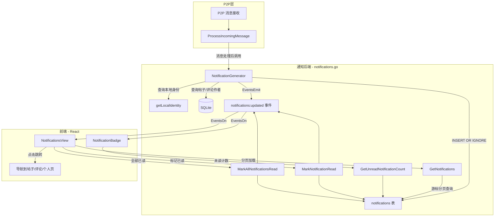
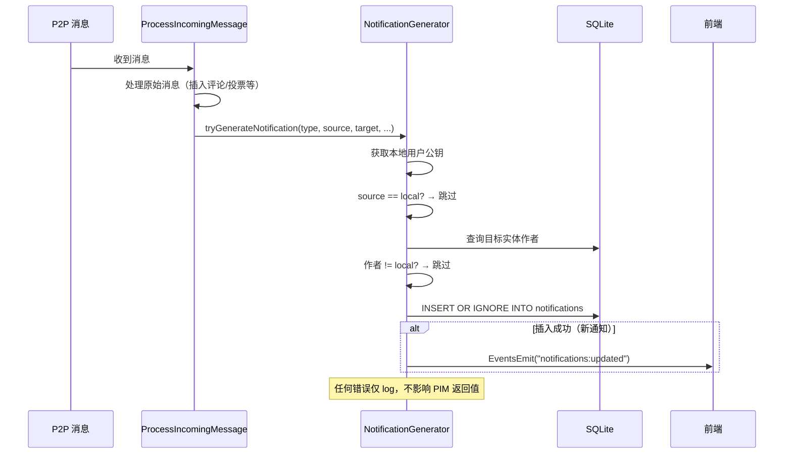

# 设计文档：通知中心（Notification Center）

## 概述

通知中心为 Aegis 去中心化 P2P 论坛提供本地通知能力。由于 Aegis 无中心服务器，所有通知在本地节点接收到 P2P 消息时生成，存储于本地 SQLite 数据库。

核心设计原则：
- **用户体验优先**：通知生成零延迟感知，点击即达目标内容，未读角标实时刷新
- **代码洁癖**：单一职责（独立 `notifications.go`），低耦合（通知生成不阻塞消息处理），无魔法值（常量化通知类型）
- **正确性 > 稳定性 > 可观测性 > 性能**：UNIQUE 约束保证去重，幂等操作保证安全，错误日志保证可观测

## 架构

### 整体架构



### 设计决策

| 决策 | 选择 | 理由 |
|------|------|------|
| 通知逻辑位置 | 独立 `notifications.go` | 单一职责，不污染已有 6000+ 行的 `db.go` |
| 通知生成时机 | `ProcessIncomingMessage` 各 case 末尾调用 | 最小侵入，通知生成在原始操作成功后执行 |
| 通知生成失败处理 | log + continue | 通知是辅助功能，不应阻塞核心消息处理 |
| 去重策略 | UNIQUE(type, source_pubkey, target_entity_id) + INSERT OR IGNORE | 数据库层面保证，无需应用层判断 |
| 分页方式 | 游标分页 base64(created_at\|id) | 复用现有 GetMyPosts/GetFavorites 模式 |
| 前端事件 | `notifications:updated` | 与 `feed:updated`、`comments:updated` 保持一致 |
| 前端入口 | Sidebar 通知图标 + NotificationsView | 与现有 ViewMode 模式一致 |
| 自我通知过滤 | 生成前比对 source_pubkey vs local_pubkey | 最早过滤，避免无效 DB 写入 |

## 组件与接口

### 后端组件（Go）

#### 1. notifications.go — 通知核心模块

```go
// ── 常量 ──

const (
    NotifTypePostComment    = "post_comment"
    NotifTypeCommentReply   = "comment_reply"
    NotifTypePostUpvote     = "post_upvote"
    NotifTypePostDownvote   = "post_downvote"
    NotifTypeCommentUpvote  = "comment_upvote"
    NotifTypeCommentDownvote = "comment_downvote"
    NotifTypeGovernance     = "governance_action"
)

// ── 数据结构 ──

type Notification struct {
    ID             string `json:"id"`
    Type           string `json:"type"`
    SourcePubkey   string `json:"sourcePubkey"`
    TargetEntityID string `json:"targetEntityId"`
    TargetType     string `json:"targetType"`     // "post" | "comment"
    PostID         string `json:"postId"`          // 关联帖子 ID，用于跳转
    IsRead         bool   `json:"isRead"`
    CreatedAt      int64  `json:"createdAt"`
}

type NotificationPage struct {
    Items      []Notification `json:"items"`
    NextCursor string         `json:"nextCursor"`
}

// ── 通知生成（内部方法，不导出） ──

// tryGenerateNotification 尝试生成一条通知，失败仅记录日志
// 调用前由调用方确保 source != local user
func (a *App) tryGenerateNotification(notifType, sourcePubkey, targetEntityID, targetType, postID string, createdAt int64) 

// getPostAuthor 查询帖子作者公钥
func (a *App) getPostAuthor(postID string) (string, error)

// getCommentAuthor 查询评论作者公钥
func (a *App) getCommentAuthor(commentID string) (string, error)

// getCommentPostID 查询评论所属帖子 ID
func (a *App) getCommentPostID(commentID string) (string, error)

// ── 导出 API（Wails 绑定） ──

// GetNotifications 分页获取通知列表，按 created_at DESC 排序
func (a *App) GetNotifications(limit int, cursor string) (NotificationPage, error)

// GetUnreadNotificationCount 返回未读通知总数
func (a *App) GetUnreadNotificationCount() (int, error)

// MarkNotificationRead 标记单条通知为已读（幂等）
func (a *App) MarkNotificationRead(notificationID string) error

// MarkAllNotificationsRead 批量标记所有未读通知为已读
func (a *App) MarkAllNotificationsRead() error
```

#### 2. db.go — ProcessIncomingMessage 修改点

在以下 case 的成功路径末尾，追加通知生成调用：

```go
// COMMENT case 末尾（insertComment 成功后）:
//   1. 查询帖子作者，若为本地用户 → tryGenerateNotification(post_comment, ...)
//   2. 若 parentID 非空，查询父评论作者，若为本地用户 → tryGenerateNotification(comment_reply, ...)

// POST_UPVOTE / POST_DOWNVOTE / POST_VOTE_SET case 末尾:
//   查询帖子作者，若为本地用户 → tryGenerateNotification(post_upvote/post_downvote, ...)

// COMMENT_UPVOTE / COMMENT_DOWNVOTE / COMMENT_VOTE_SET case 末尾:
//   查询评论作者，若为本地用户 → tryGenerateNotification(comment_upvote/comment_downvote, ...)

// SHADOW_BAN / UNBAN case 末尾:
//   若 target_pubkey 为本地用户 → tryGenerateNotification(governance_action, ...)
```

#### 3. ensureSchema 修改点

在 `ensureSchema` 的 schema 切片中追加 notifications 表和索引的 CREATE 语句。

### 前端组件（React + TypeScript）

#### 1. NotificationsView.tsx — 通知列表视图

```typescript
interface NotificationsViewProps {
    profiles: Record<string, Profile>;
    onNavigateToPost: (postId: string, commentId?: string) => void;
    onNavigateToProfile: () => void;
}
```

职责：
- 调用 `GetNotifications(limit, cursor)` 分页加载通知
- 渲染通知列表（类型图标 + 来源用户名 + 内容摘要 + 时间 + 已读状态）
- 提供"全部标记为已读"按钮
- 无限滚动加载下一页
- 点击通知 → 自动标记已读 + 跳转到目标内容
- 空状态提示

#### 2. Sidebar.tsx 修改 — 通知入口

在 Recommended Feed 按钮和 My Subscriptions 之间添加通知入口：

```typescript
// 新增 props
interface SidebarProps {
    // ... 现有 props
    unreadNotificationCount: number;
    onNotificationsClick: () => void;
}
```

通知入口渲染逻辑：
- 使用 `notifications` material icon
- 未读数 > 0 时显示角标（数字）
- 未读数 > 99 时显示 "99+"

#### 3. App.tsx 修改

- `ViewMode` 类型新增 `'notifications'`
- 新增状态：`unreadNotificationCount: number`
- 监听 `notifications:updated` 事件 → 刷新未读计数
- 应用启动时获取初始未读计数
- 路由到 `NotificationsView` 组件

#### 4. types/index.ts 修改

```typescript
export interface Notification {
    id: string;
    type: string;
    sourcePubkey: string;
    targetEntityId: string;
    targetType: string;
    postId: string;
    isRead: boolean;
    createdAt: number;
}

export interface NotificationPage {
    items: Notification[];
    nextCursor: string;
}
```


## 数据模型

### notifications 表

```sql
CREATE TABLE IF NOT EXISTS notifications (
    id TEXT PRIMARY KEY,
    type TEXT NOT NULL,
    source_pubkey TEXT NOT NULL,
    target_entity_id TEXT NOT NULL,
    target_type TEXT NOT NULL DEFAULT 'post',
    post_id TEXT NOT NULL DEFAULT '',
    is_read INTEGER NOT NULL DEFAULT 0,
    created_at INTEGER NOT NULL,
    UNIQUE(type, source_pubkey, target_entity_id)
);

CREATE INDEX IF NOT EXISTS idx_notifications_created_at ON notifications(created_at DESC);
CREATE INDEX IF NOT EXISTS idx_notifications_is_read ON notifications(is_read, created_at DESC);
```

### 字段说明

| 字段 | 类型 | 说明 |
|------|------|------|
| `id` | TEXT PK | 通知唯一 ID，格式：`sha256(type\|source_pubkey\|target_entity_id)[:16]` |
| `type` | TEXT | 通知类型枚举：`post_comment`, `comment_reply`, `post_upvote`, `post_downvote`, `comment_upvote`, `comment_downvote`, `governance_action` |
| `source_pubkey` | TEXT | 触发通知的用户公钥 |
| `target_entity_id` | TEXT | 目标实体 ID（帖子 ID 或评论 ID） |
| `target_type` | TEXT | 目标实体类型：`post` 或 `comment` |
| `post_id` | TEXT | 关联帖子 ID，用于前端跳转定位 |
| `is_read` | INTEGER | 已读状态：0=未读，1=已读 |
| `created_at` | INTEGER | 创建时间戳（Unix 秒） |

### 去重机制

UNIQUE 约束 `(type, source_pubkey, target_entity_id)` 确保：
- 同一用户对同一实体的同类型操作只产生一条通知
- 使用 `INSERT OR IGNORE` 实现幂等写入，无需应用层去重判断

### 通知 ID 生成

```go
func buildNotificationID(notifType, sourcePubkey, targetEntityID string) string {
    raw := fmt.Sprintf("%s|%s|%s", notifType, sourcePubkey, targetEntityID)
    hash := sha256.Sum256([]byte(raw))
    return hex.EncodeToString(hash[:])[:16]
}
```

ID 由 UNIQUE 约束的三个字段确定性生成，保证：
- 相同输入 → 相同 ID（幂等）
- 不同输入 → 不同 ID（无碰撞，16 hex = 64 bit 空间足够）

### 游标编码

复用现有模式：

```go
func encodeNotificationCursor(createdAt int64, id string) string {
    return base64.StdEncoding.EncodeToString(
        []byte(fmt.Sprintf("%d|%s", createdAt, id)),
    )
}

func decodeNotificationCursor(cursor string) (int64, string, error) {
    // base64 decode → split by "|" → parse timestamp + id
}
```

### 通知生成流程



### 通知类型与触发条件映射

| 消息类型 | 通知类型 | target_entity_id | target_type | post_id | 条件 |
|----------|----------|------------------|-------------|---------|------|
| COMMENT | post_comment | comment.ID | comment | comment.PostID | 帖子作者 == 本地用户 |
| COMMENT | comment_reply | comment.ID | comment | comment.PostID | 父评论作者 == 本地用户 |
| POST_UPVOTE | post_upvote | postID | post | postID | 帖子作者 == 本地用户 |
| POST_DOWNVOTE | post_downvote | postID | post | postID | 帖子作者 == 本地用户 |
| COMMENT_UPVOTE | comment_upvote | commentID | comment | postID | 评论作者 == 本地用户 |
| COMMENT_DOWNVOTE | comment_downvote | commentID | comment | postID | 评论作者 == 本地用户 |
| SHADOW_BAN | governance_action | targetPubkey | user | "" | 目标 == 本地用户 |
| UNBAN | governance_action | targetPubkey | user | "" | 目标 == 本地用户 |


## 正确性属性（Correctness Properties）

*正确性属性是系统在所有有效执行中都应保持为真的特征或行为——本质上是关于系统应该做什么的形式化陈述。属性是人类可读规范与机器可验证正确性保证之间的桥梁。*

### Property 1: 评论触发帖子通知

*For any* COMMENT 消息，若该评论的目标帖子作者为本地用户且消息发送者不是本地用户，则 notifications 表中应存在一条 `post_comment` 类型的通知，其 `source_pubkey` 为评论者公钥，`target_entity_id` 为评论 ID，`post_id` 为帖子 ID。

**Validates: Requirements 2.1**

### Property 2: 回复触发评论通知

*For any* COMMENT 消息，若该评论有父评论且父评论作者为本地用户且消息发送者不是本地用户，则 notifications 表中应存在一条 `comment_reply` 类型的通知，其 `source_pubkey` 为评论者公钥，`target_entity_id` 为评论 ID。

**Validates: Requirements 2.2**

### Property 3: 帖子投票触发通知

*For any* POST_UPVOTE 或 POST_DOWNVOTE 消息，若目标帖子作者为本地用户且投票者不是本地用户，则 notifications 表中应存在一条对应类型（`post_upvote` 或 `post_downvote`）的通知，其 `source_pubkey` 为投票者公钥，`target_entity_id` 为帖子 ID。

**Validates: Requirements 2.3, 2.4**

### Property 4: 评论投票触发通知

*For any* COMMENT_UPVOTE 或 COMMENT_DOWNVOTE 消息，若目标评论作者为本地用户且投票者不是本地用户，则 notifications 表中应存在一条对应类型（`comment_upvote` 或 `comment_downvote`）的通知，其 `source_pubkey` 为投票者公钥，`target_entity_id` 为评论 ID。

**Validates: Requirements 2.5, 2.6**

### Property 5: 治理操作触发通知

*For any* SHADOW_BAN 或 UNBAN 消息，若目标公钥为本地用户，则 notifications 表中应存在一条 `governance_action` 类型的通知。

**Validates: Requirements 2.7**

### Property 6: 自我通知过滤

*For any* 可能触发通知的消息，若消息发送者（source_pubkey）与本地用户公钥相同，则 notifications 表中不应产生任何新通知。

**Validates: Requirements 2.8**

### Property 7: 通知生成不阻塞消息处理

*For any* 消息类型，即使通知生成过程中发生数据库错误，ProcessIncomingMessage 仍应成功完成原始消息的处理并返回 nil error。

**Validates: Requirements 2.9**

### Property 8: 分页完整性与排序

*For any* notifications 表中的 N 条通知，以固定 limit 逐页遍历（首次 cursor 为空，后续使用返回的 nextCursor），最终收集到的通知应恰好为 N 条，按 created_at 严格降序排列，无重复、无遗漏。

**Validates: Requirements 3.1, 3.3, 3.4**

### Property 9: 未读计数一致性

*For any* notifications 表状态，GetUnreadNotificationCount() 的返回值应等于表中 `is_read = 0` 的记录数。

**Validates: Requirements 3.2**

### Property 10: 单条标记已读

*For any* 通知 ID，调用 MarkNotificationRead(id) 后，该通知的 `is_read` 应为 1，且其他通知的 `is_read` 状态不变。

**Validates: Requirements 4.1**

### Property 11: 批量标记已读

*For any* notifications 表状态（含 N 条未读通知），调用 MarkAllNotificationsRead() 后，GetUnreadNotificationCount() 应返回 0，且所有通知的 `is_read` 均为 1。

**Validates: Requirements 4.2**

### Property 12: 标记已读幂等性

*For any* 字符串 id（无论是否为有效通知 ID），调用 MarkNotificationRead(id) 应返回 nil error。对同一通知多次调用结果不变。

**Validates: Requirements 4.4**

### Property 13: 通知点击路由正确性

*For any* 通知类型，点击路由函数应返回正确的目标：`post_comment`/`comment_reply`/`comment_upvote`/`comment_downvote` → 帖子详情页 + 评论定位；`post_upvote`/`post_downvote` → 帖子详情页；`governance_action` → 个人资料页。

**Validates: Requirements 6.1, 6.2, 6.3, 6.4**

### Property 14: 未读角标显示格式

*For any* 非负整数 count，角标显示函数应满足：count == 0 → 不显示；1 ≤ count ≤ 99 → 显示数字字符串；count > 99 → 显示 "99+"。

**Validates: Requirements 7.2, 7.3**

### Property 15: 通知去重

*For any* 通知参数组合 (type, source_pubkey, target_entity_id)，连续调用 tryGenerateNotification 两次，notifications 表中该组合的记录数应恰好为 1。

**Validates: Requirements 8.1, 8.2, 8.3**

## 错误处理

### 后端错误处理策略

| 场景 | 处理方式 | 理由 |
|------|----------|------|
| 通知生成时 DB 写入失败 | `log.Printf` 记录错误，不返回 error | 通知是辅助功能，不阻塞核心消息处理 |
| 通知生成时查询帖子/评论作者失败 | `log.Printf` 记录错误，跳过通知生成 | 可能是数据尚未同步，不应阻塞 |
| `getLocalIdentity()` 失败 | 跳过通知生成，不记录错误 | 用户未创建身份时无需通知 |
| `GetNotifications` 游标解码失败 | 返回 error | 调用方传入了无效参数，应明确报错 |
| `GetNotifications` DB 查询失败 | 返回 error | 查询失败是严重问题，前端需要知道 |
| `MarkNotificationRead` 目标不存在 | 返回 nil（幂等） | UPDATE WHERE id = ? 影响 0 行是正常的 |
| `MarkAllNotificationsRead` DB 失败 | 返回 error | 批量操作失败需要前端重试 |

### 前端错误处理策略

| 场景 | 处理方式 |
|------|----------|
| `GetNotifications` 调用失败 | 显示错误提示，保留已加载数据 |
| `GetUnreadNotificationCount` 调用失败 | 角标显示为 0，静默重试 |
| `MarkNotificationRead` 调用失败 | 乐观更新 UI，后台重试 |
| 通知关联内容已删除 | 显示"内容已删除"提示，不执行跳转 |
| 来源用户 profile 不存在 | 显示截断的公钥作为用户名 |

## 测试策略

### 双轨测试方法

本功能采用单元测试 + 属性测试的双轨策略：

- **单元测试**：验证具体示例、边界条件、集成点
- **属性测试**：验证所有输入上的通用属性

### 属性测试配置

- **Go 属性测试库**：`testing/quick`（标准库，零依赖）
- **TypeScript 属性测试库**：`fast-check`
- **每个属性测试最少运行 100 次迭代**
- **每个属性测试必须用注释引用设计文档中的属性编号**
- **标签格式**：`Feature: notification-center, Property {number}: {property_text}`
- **每个正确性属性由一个属性测试实现**

### 后端测试（Go）

#### 属性测试

| 属性 | 测试文件 | 说明 |
|------|----------|------|
| Property 1-5 | `notifications_gen_test.go` | 通知生成：随机消息类型 + 随机用户 → 验证通知是否正确生成 |
| Property 6 | `notifications_gen_test.go` | 自我过滤：source == local → 无通知 |
| Property 7 | `notifications_gen_test.go` | 错误隔离：模拟 DB 错误 → 消息处理不受影响 |
| Property 8 | `notifications_query_test.go` | 分页完整性：随机插入 N 条 → 逐页遍历 → 验证完整性和排序 |
| Property 9 | `notifications_query_test.go` | 未读计数：随机已读/未读状态 → 验证计数一致 |
| Property 10-12 | `notifications_read_test.go` | 已读状态管理：随机通知集 → 标记已读 → 验证状态变更 |
| Property 15 | `notifications_dedup_test.go` | 去重：相同参数重复插入 → 验证只有一条 |

#### 单元测试

| 测试 | 说明 |
|------|------|
| 表结构验证 | 验证 notifications 表包含所有必需列（Requirements 1.1, 1.3） |
| 空游标首页 | 验证 cursor="" 返回最新通知 |
| 无效游标报错 | 验证非法 cursor 返回 error |
| 空通知列表 | 验证无通知时返回空数组 |
| 事件发射 | 验证通知生成/已读变更后发射 notifications:updated 事件（Requirements 4.3, 5.1） |

### 前端测试（TypeScript）

#### 属性测试

| 属性 | 测试文件 | 说明 |
|------|----------|------|
| Property 13 | `NotificationsView.test.ts` | 路由正确性：随机通知类型 → 验证跳转目标 |
| Property 14 | `NotificationBadge.test.ts` | 角标格式：随机非负整数 → 验证显示文本 |

#### 单元测试

| 测试 | 说明 |
|------|------|
| 通知列表渲染 | 验证每条通知显示所有必需信息（Requirements 7.5） |
| 空状态渲染 | 验证空列表显示提示信息（Requirements 7.8） |
| 事件监听 | 验证 notifications:updated 事件触发数据刷新（Requirements 5.2） |
| 已删除内容处理 | 验证点击已删除内容的通知显示提示（Requirements 6.6） |
