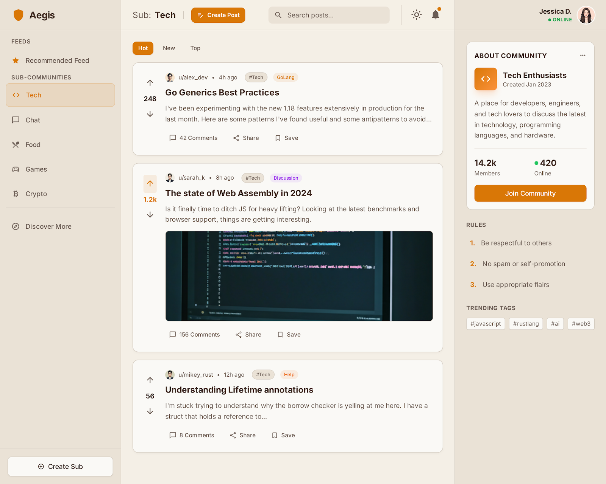
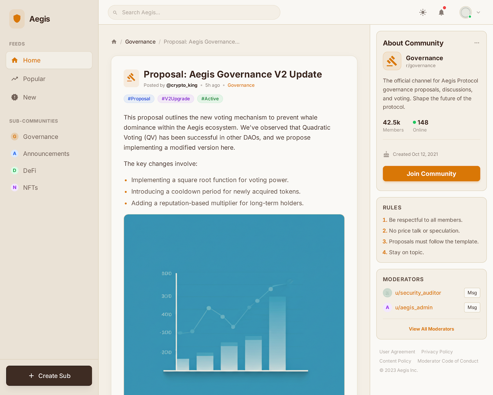
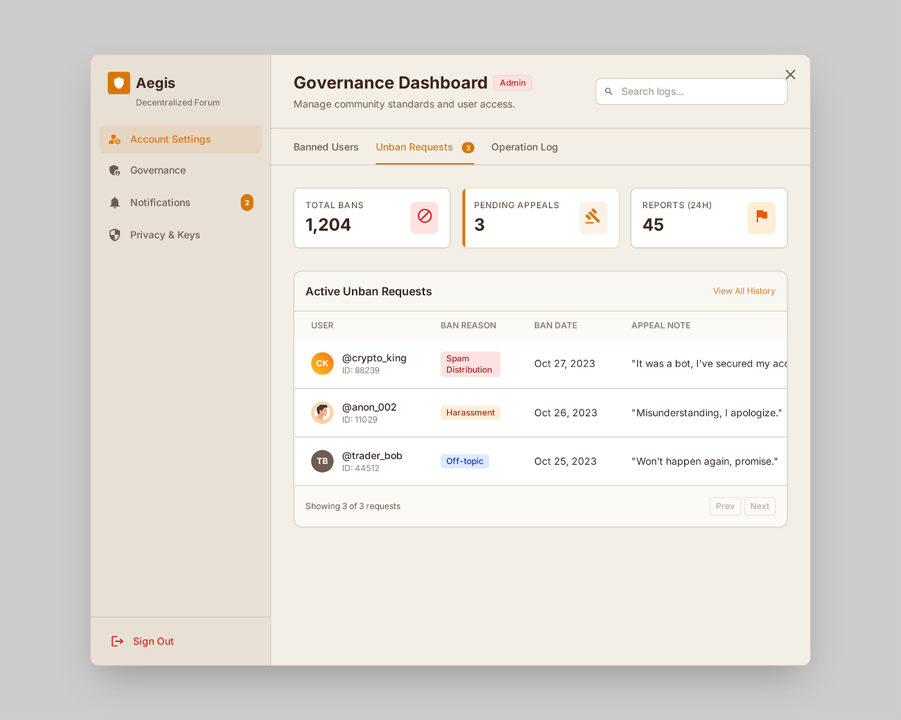
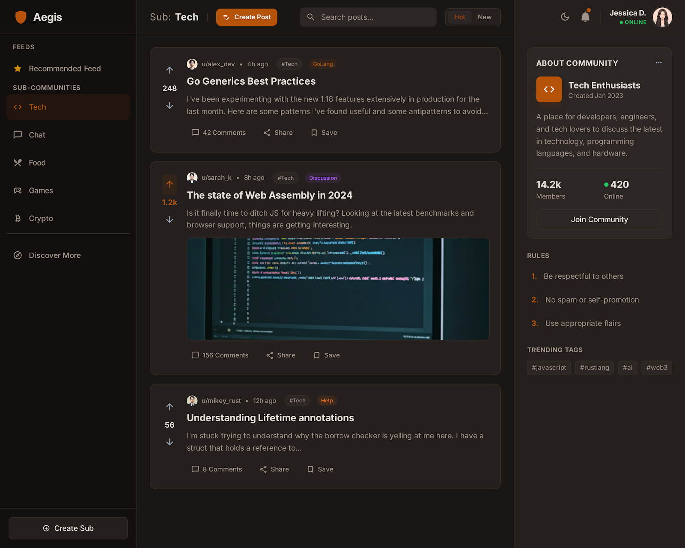
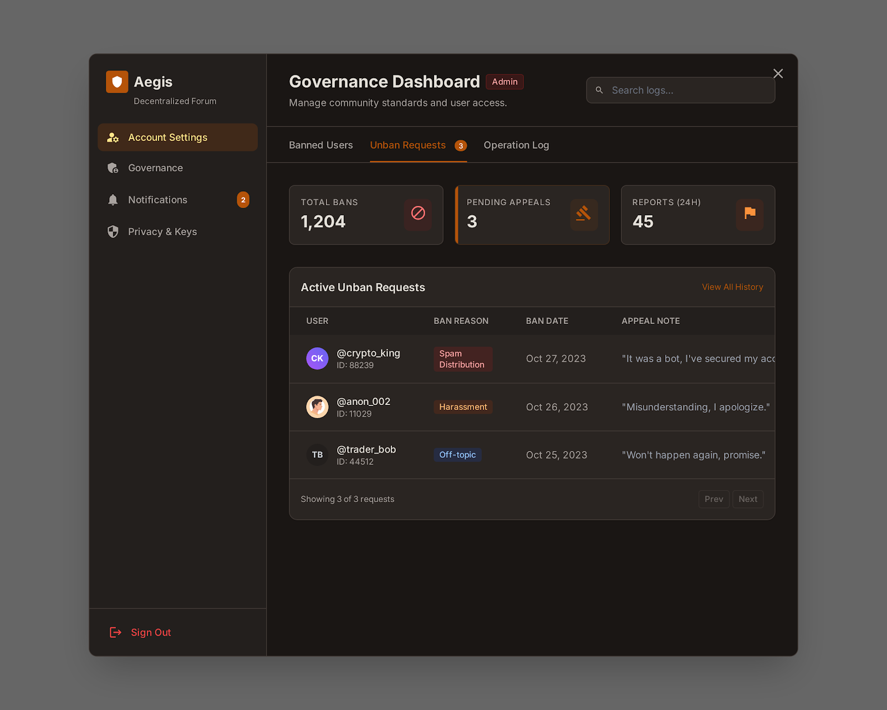
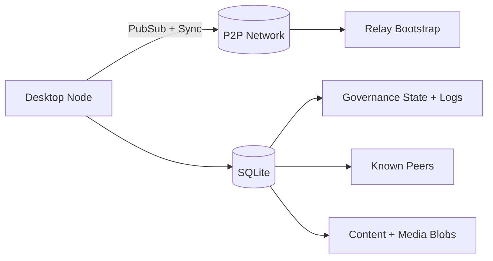

# Aegis

<p align="center">
  
</p>

<p align="center">
  <b>Decentralized forum infrastructure with deterministic governance.</b><br/>
  Built for real-world peer-to-peer networks, not toy demos.
</p>

<p align="center">
  
  
  
  
  
  
  
</p>

<p align="center">
  
  
  
</p>

<p align="center">
  
  
  
</p>

---

## Technology Stack

### Core Platform
- Go backend (`libp2p`, `pubsub`, `modernc.org/sqlite`)
- React + TypeScript frontend with Wails desktop runtime
- SQLite persistence with additive migration strategy

### Network and Sync
- Gossip-based message propagation
- Anti-entropy summary sync + targeted content/media fetch
- Known-peer persistence + peer exchange for self-sustaining discovery
- Relay bootstrap with direct-connection preference when possible

### CI and Distribution
- GitHub Actions desktop pipelines (Windows/Linux/macOS ARM)
- Tag-based official releases + manual draft beta release mode

---

## What Aegis Is

Aegis is a desktop-first decentralized social forum powered by **Go + libp2p + SQLite + React + Wails**.

It focuses on three hard problems most social prototypes skip:

- **Reliable sync in messy networks** (NAT, mixed connectivity, relay fallback)
- **Deterministic moderation ordering** (Lamport-first governance semantics)
- **Storage responsibility control** (shared vs private burden separation)

---

## Why It Stands Out

- **Network-native design**: anti-entropy, known peers, peer exchange, relay bootstrap
- **Consistency-first governance**: Lamport-first shadow-ban/unban acceptance logic
- **Policy-aware serving**: disallowed content does not silently become shared network cost
- **Modern desktop UX**: post/comment media, attachment previews, zoom, governance + ops UI
- **Production-minded CI/CD**: cross-platform builds and release pipeline

---

## System At A Glance



---

## Feature Highlights

### Distributed Forum Core
- Sub communities, feed/search, post detail, threaded comments
- Public/private lanes
- Anti-entropy repair for eventual consistency

### Governance and Trust
- Lamport-first moderation acceptance with timestamp fallback
- Unified policy checks across ingest, query, sync, and serving paths
- Moderation reconciliation through synced state and logs
- Future-only policy semantics for shadow-ban transitions
- Deterministic tie-break strategy to avoid split-brain moderation outcomes
- Storage-governance sealing: disallowed content does not become shared replica burden

### P2P Resilience
- Cold-start relay support
- Auto/public announce support with explicit override
- Known-peer persistence + peer exchange to reduce central dependence over time

### Media and Storage
- Structured comment attachments (`media_cid`, `external_url`)
- Policy-aware media serving
- Shared/private storage responsibility accounting

---

## Beta Status

| Stage | Status |
|---|---|
| BETA-0 | Done |
| BETA-1 | Done |
| BETA-2 | Done |
| BETA-3 | Rollout-ready |

Plans and runbooks:

- `docs/BETA_ROLLOUT_PLAN_2026-02-20.md`
- `docs/RELAY_SELF_BOOTSTRAP_PLAN_2026-02-20.md`
- `docs/LAMPORT_AND_SHADOWBAN_STORAGE_GOVERNANCE_PLAN_2026-02-18.md`
- `docs/R5_OBSERVABILITY_RUNBOOK.md`

---

## Repository Structure

- `aegis-app/` - main application (Go backend + React frontend)
- `docs/` - architecture, governance, rollout, and ops docs
- `.github/workflows/` - build and release automation

---

## Release Flow

### Official release (tag-triggered)

```bash
git tag -a v0.1.1 -m "release v0.1.1"
git push origin v0.1.1
```

### Manual draft release (beta cohorts)

Run workflow manually with:

- `publish_draft_release=true`
- optional `draft_tag_name=<name>`

---

## Developer Entry Point

Start here for full setup and runtime details:

- `aegis-app/README.md`
